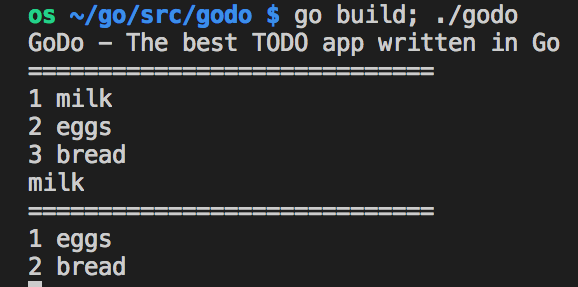

# 21.1 Lesson Plan - Introduction to Go Language

## Overview

Today's lesson plan will introduce students to the basics of Go language (GoLang). 

### Instructor Priorities

* Objectives for today's lesson:
  * Students can declare variables of basic types
  * Students can print to standard output to the console
  * Students can read standard input from the console
  * Students can declare and call functions
  * Students can use Go's for loops
  * Students can declare and modify Go slices (arrays)
  * Students can utilize if else conditions

### Instructor Notes

* Please make sure all students have properly installed what they will need on their development environment to complete today's lesson. 
* If any students had issues installing required software please refer them to [activities/01-installation/instructions.txt](activities/01-installation/instructions.txt) you sent out last class.
* Have your TAs refer to the [Time Tracker](./Intro-To-Go-Lang-TimeTracker.xlsx) to stay on track.

## Class Objectives

At the end of class, students will be able to use GoLang to:

* Write basic console applications with user input
* Understand GoLang is a strongly type language
* Able to work with GoLang types

### 1. Everyone Do: Verify GoLang Installation (0:05)

* Before diving into the awesome world of Go, take a few minutes to verify everyone's development environment. It's a good idea to have you and your TAs split up to make this process faster.

* Instruct everyone to open up their terminal 

  * Run `go version`

  * They should see the version number output similar to the below example

    ```bash
    os ~ $ go version
    go version go1.9 darwin/amd64
    ```

  * Now instruct students to install Gore. Gore is a REPL ([Read–eval–print loop](https://en.wikipedia.org/wiki/Read%E2%80%93eval%E2%80%93print_loop)) for GoLang. It allows them to play with the Go language without needing to create and compile a program.

    * Run this command to install Gore

    ```bash
    go get -u github.com/motemen/gore
    ```

### 2. Everyone Do: Go Basics (0:10)

#### Objectives

* Use Gore to experiment with Go code
* Understand Go syntax and common types
* Convert between types
* Go functions and closures

------

* Briefly explain what is a **REPL** ([Read–eval–print loop](https://en.wikipedia.org/wiki/Read%E2%80%93eval%E2%80%93print_loop)) environment. It is a playground for learning Go.

* Explain that before we jump into creating our first app we can learn the basic syntax of Go with **Gore**.

* Instruct students to run `gore` in there Terminal.

  * They should see a simular prompt like the one below:

    ```bash
    gore version 0.3.0  :help for help
    gore>
    ```

* Explain to students that GoLang is a strongly typed language unlike JavaScript.

* Instruct the students to follow alone with you in this activity. You can refer to the example file for each line in these activity [activities/02-go-basic/gore-examples.go.txt](activities/02-go-basic/gore-examples.go.txt) 

  * Create a string variable.

    ```go
    gore> var firstName string = "Bobby"
    ```

    * Point out that we start with `var` keyword very similar to JavaScript.
    * Followed by the name we want for the variable
    * Then the type we want to store in this variable. In this case `string`
    * Finally we use the `=` operator to set the new variable to `"Bobby"`

  * Type out the new variable name in Gore, Enter and it will return the value.

    ```go
    gore> firstName
    "Bobby"
    ```

  * Now lets assign a new value to `firstName` to `"Frank"` and hit Enter.

    ```go
    gore> firstName = "Frank"
    "Frank"
    ```

    _Note: the `firstName` variable now equals `"Frank"` not `"Bobby"`_

  * Declare a integer variable then type out the variable name and return.

    ```go
    gore> var age = 21
    gore> age
    "21"
    ```

  * Let's see what happens when we try to assign a integer value to our string variable.

    ```bash
    gore> firstName = 21
    cannot use 21 (type int) as type string in assignment
    error: exit status 2
    exit status 2
    ```

    _Note: Go compiler will not allow you to set a variable to a different type. This is much different then dynamic languages like JavaScript._

  * To save a integer in a string variable you would need to convert the `int` type into a `string` type. This is called casing and its common task in strongly typed languages.

  * Let's case our integer value into the our string variable. 

  * There are a few different ways to do this in Go but the simplest way to convert most types into a string is to use `fmt.Sprintf()`(See [Documentation](https://golang.org/pkg/fmt/#Sprintf) ).

  * Go has standard packages with functions that we can re-use. We will be using the `fmt` package that contains a handy function called `Sprintf`. It's only job is to format a set of variables into a string.

    * We will discuss more string formatting when we work on the console applications. For now just tell them the first parameter is a string template, `%v` is a placeholder for the second parameter `21`

    ```go
    gore> firstName = fmt.Sprintf("%v", 21)
    "21"
    ```

  * Now let's declare a Boolean variable in Go and return it in Gore

    ```go
    gore> var isAlive bool = true
    gore> isAlive
    true
    ```

  * Declare an float and return its value

    ```go
    gore> var bodyTemp float32 = 98.6
    gore> bodyTemp
    98.6
    ```

  * Explain to the students that Go has an easier way to declare variables. 

    * Go's variables can be declared with implicit type. 
    * There is no need to have the `var` keyword or specify the variable's type. 
    * The Go compiler will infer what type you are using.

    ```go
    gore> lastName := "Smith"
    gore> lastName
    "Smith"
    ```

    Note: This is much shorter syntax compared to `var lastName string = "Smith"`

  * Explain to students that Go has functions that work similar to JavaScript functions. 

    * They contain a code block that can be called from another part of your program.

  * Let's defined one in Gore

    ```go
    gore > sum := func(x int, y int) int { return x + y }
    ```

  * Functions are defined using the `func` keyword. 

    * Go functions, like JavaScript, can have parameters and return values.

  * Explain that this particular example is called a **closure**. 

    * Closures are simply nameless functions that are passed into a variable.
    * Explain that we will also use regular Go functions today.
    * Explain that parameters and return values also need their types defined
      * `(x int, y int)` are the parameters. 
        * Explain that the type always comes after the name.
      * `...) int {...` the `int` between the parentheses and square bracket is the return type.
      * Between the cruly brackets is the code block `{ return x + y }`. 
        * Since we defined a return type we must always return a value of that type using keyword `return`.

  * Let's call our new function with 2 and 3 as the parameters. Our result should be 5.

    ```
    gore> sum(2,3)
    5
    ```

* We are done with Gore for this lesson. 

* Instruct students to **quit** Gore using keyboard combination `Ctrl` + `D`

### 3. Everyone Do: In's and Out's (0:20)

#### Objectives

* Understand Go workspace
* Understanding the fundmentals of Go's packages and imports
* Declare a main function for Go console apps
* Print standard output to the console
* Read standard input from the user
* Define if conditional in Go
* Define for loop in Go

------

* Explain to students that Go has to be compiled and that the Go compiler must work in a **workspace** to compile all Go programs. 

* Explain that a Go workspace is simply a single folder on their computers that stores all Go source code, including Go code they will write.

* It's easy to locate the Go workspace directory by opening the BASH terminal and running the following command

  ```bash
  echo $GOPATH
  /Users/janedeveloper/go
  ```

  _Note: Path will be different on every machine but usually is under the current users home folder_

* Slack out the example [activities/03-ins-outs/03-ins-outs.go](activities/03-ins-outs/03-ins-outs.go).

* Instruct students to move or copy `03-ins-outs.go` into your Go workspace (your `$GOPATH`) into a folder called `03-ins-outs`

  - Remember Go build tool only works if your code is in the Go workspace
  - Remind students to `echo $GOPATH` to find your Go workspace

* **Make sure all students are able to compile this Go console app. It is critical to the last activity for today.** 

* Explain the first line to the students is required by Go to know what **package** namespace you are defining your program in. 

  ```go
  package main
  ```

  _NOTE: We don't have enough time in this lesson to dive into Go packages and namespaces but if students want to dive deeper share this link [GoLang - Packages](https://www.golang-book.com/books/intro/11)_

* Explain the import statement defines what other packages your app will need. 

  * In this program we need  `fmt` to write to the console, `bufio` for read user inputs from the console, and `os` for accessing standard input.

  ```go
  import (
  	"bufio"
  	"fmt"
  	"os"
  )
  ```

* Explain that in Go applications we need a `main` function to run our code.

  * Explain to students that the `main` function is defined just like any other Go function.
    * Starts with `func` keyword 
    * Following the name. 
      * In the case of making a main function for an app we need to call it `main`
    * Ends with a parentheses pair `()` and a open curly bracket `{`
    * The end of the function must always have a closing curly bracket `}`
  * Note that Go **functions** are like the **closure** we defined in the Gore activity.

* Explain the first line in the main function is how we print to the console.

  * It uses Go's `fmt` package for working with standard input and output.

  * `fmt.Println()` prints a string with a new line ending to standard output (terminal)

    ```go
    fmt.Println("Hello, NOW GO!")
    ```

* Declare a input scanner to start capturing user input. 

  * Remind students that we are using Go's implicit variable assignment `:=` here. There is no need to specify the variables type. 

      ```go
      scanner := bufio.NewScanner(os.Stdin)
      ```

  * Explain that we need to pass in Go's `os.Stdin` for the scanner to scan for new user inputs

* Explain that to use the scanner we need to setup a loop to process each time the user inputs data

  * We will use the `for` and `scanner.Scan()` as the condition to loop for new input

    * Inside the for loop we need to grab the input into a string variable.

    * ```
      text := scanner.Text()
      ```

    * Let's set a condinational to break the loop and essentially quit the program.

    * We will use Go's `if` conditional to check if the user entered `"quit"`and if so print a message and `break` the for loop.

    * If the user did not entered in `"quit"` then we just print a message.

* Now let's see it all together.

* ```go
    package main
    
    import (
    	"bufio"
    	"fmt"
    	"os"
    )
    
    func main() {
        fmt.Println("Hello, NOW GO!")
        scanner := bufio.NewScanner(os.Stdin)
    
        for scanner.Scan() {
            text := scanner.Text()
            if text == "quit" {
                fmt.Println("Good day to you!")
                break
            }
            fmt.Println("Please Go!")
        }
    }
    ```

* Let's compile and run our Go console app

    * Instruct students to open a BASH terminal and change directory to the file in their Go workspace

        Example:

        ```bash
        cd /Users/janedeveloper/go/03-ins-out
        ```

    * Then run the Go compiler

    * ```bash
        go build
        ```

    * Instruct students to look at the directory contents they will see a new file called `03-ins-out` or for Windows `03-ins-out.exe` in `~/go/03-ins-out` directory. 

    * Explain to students that this file is the binary executable created by the Go compile. 

    * Explain that, unlike scripting languages like JavaScript, Go programs are compiled into an executable binary that does not need any additional program to interpret its code.

    * To run a Go program you just execute the binary file directly

        ```bash
        ./03-ins-out
        ```

        * `./` tells BASH to execute the `03-ins-out` (or `03-ins-out.exe`) binary

### 4. Instructor Do: Arrays and Slices (0:15)

#### Objectives

- Declare Go arrays
- Declare Go slices
- Append new elements into a slice
- Get the length (count) of a slice

------

- Explain to students that Go has **arrays** just like JavaScript but not quite the same. 

  - Go arrays are a **fixed size** when defined; you can't add or remove elements.
  - Go arrays can only contain one type.

- Either open up the example file [activities/04-arrays-slices/04-arrays-slices.go](activities/04-arrays-slices/04-arrays-slices.go) or if you are comfortable try to live code this activity.

- Create a new Go console app and declare a string array with capacity of three elements.

- ```go
  var favoriteColors [3]string
  ```

- Explain that this array does contain three elements but do not have values yet.

  - Let's look into how we can set the elements values in an array.

  - ```go
    favoriteColors[0] = "blue"
    favoriteColors[1] = "red"
    favoriteColors[2] = "green"
    ```

  - Notice how there are indexes to the elements in an array.

  - Just like in JavaScript arrays, square bracket syntax `[n]` is a way to access an item by index number in a Go array.

  - Let's print the array with `fmt.Println(favoriteColors)`

    Results:

  - ```go
    [blue red green]
    ```

  - Now what will happen if we try to set more then three items in this array?

    ```go
    favoriteColors[3] = "orange"
    ```

    * You will get a invalid array index (out of bounds) error.
    * It is because Go arrays are fix size and can't be grown or shrink.

- Let's look at another way to set a string array in Go

  ```go
  favoriteSongs := [2]string{"Every Rose Has Its Thorn", "Livin' La Vida Loca"}
  ```

  * First off we are declaring using implicit type `:=` . So we don't need to specify the type.

  - The other difference is that we now have a `{ }` curly bracket with a series of string values.
  - Explain that these series of string variables corresponds with the length of the array
  - Go arrays are hard to work with in most cases. There is another way to **slice** it. 

- Explain to students that Go has another way to store a **collection of variables** besides arrays.

- Explain that Go **slices** are like arrays but can be **resized**.

- Declaring a slice is almost like declaring an array but you leave out the number in the square brackets `[]`

- ```go
  favoriteMovies := []string{"Star Wars", "Matrix"}
  ```

- Let's try to add some more elements to this slice using the `append()` function

- ```go
  // append two more elements
  favoriteMovies = append(favoriteMovies, "The Notebook")
  favoriteMovies = append(favoriteMovies, "Home Alone")
  ```

  - The `append()` function takes two parameters. 
    - First parameter the original slice
    - Second parameter the new element
    - `append()`returns a new slice with the new elements
    - We must set the `favoriteMovies` to this new slice `append` created

- Explain to students that there is a way to get the full count of elements in an array or slice.

  - `len()` is a function that you pass in an array or slice and it will return the total count of elements.
  - `len()` is very useful in `for` loops

- Slack out the example [activities/04-arrays-slices/04-arrays-slices.go](activities/04-arrays-slices/04-arrays-slices.go) for students to review.

### 6. Instructor Do: Demo GoDo (0:05)

* Copy the solved [activities/08-GoDo/Solved/08-GoDo.go](activities/08-GoDo/Solved/08-GoDo.go) to your Go workspace

* Build and run the GoDo app




* Explain GoDo is a todo app that keeps track of items in a list.
  * When you launch the app it should print a default list of items
  * If you want to add a new item just type the name and press `enter`
  * If you want to remove an existing item just re-type the item and press `enter`
  * If you wish to exit the app just type `quit` and press `enter`
* Explain to the students that the starter code has two functions to help them remove and get the index number of an element in a slice. They will need to use these functions to finish the activity.

### 7. Students Do: GoDo (0:25)

- Slack out the unsolved [activities/08-GoDo/Unsolved/08-GoDo.go](activities/08-GoDo/Unsolved/08-GoDo.go).
- Instructions are included in the file, so there is no need to slack them out separately.
- Remind students that they need to move or copy the starter file to a place in there Go workspace.

### 8. Instructor Do: Review GoDo (0:10)

- Open up the solved [activities/08-GoDo/Solved/08-GoDo.go](activities/08-GoDo/Solved/08-GoDo.go).
- Ask a student to explain how they implemented the `renderList()` function
- Ask a student to explain how they read user input from the console.
- Ask a student to explain how they they implemented conditional logic to add and remove items out of the list (slice).
- Ask a student how they made the exited the program when a user typed `quit`


